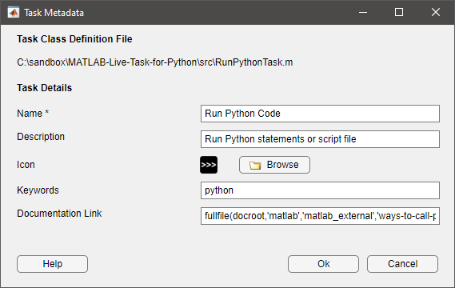
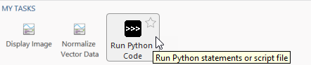

# MATLAB Live Task for Python

[](https://www.mathworks.com/matlabcentral/fileexchange/111240-matlab-live-task-for-python)

The MATLAB® Live Task for Python® enables you to write and execute Python code directly inside of a MATLAB Live Script. Since R2022a, MATLAB provides a way to develop your own [custom live task](https://www.mathworks.com/help/matlab/creating_guis/live-task-development-overview.html).

---

## Requirements
### Required MathWorks Products
* MATLAB R2022a or later

### Required 3rd Party Products
* Python (supported Python versions by MATLAB release can be found [here](https://www.mathworks.com/support/requirements/python-compatibility.html))

---

## Install
Run the `install` script to add the required paths to your MATLAB environment and configure the MATLAB Live Task for Python. Click 'Ok' when promtped with the following UI to configure the Live Editor task metadata:



---

## Getting Started
To insert the live task in your live script:

1. Go to the Live Editor tab in the Editor Toolstrip and select Task: 

    

2. Then, choose the live task under the MY TASKS category:

    

Alternatively you may simply type `python` and the autocomplete feature will suggest the appropriate task:


This is what the MATLAB Live Task for Python looks like:


First, create a variable in the MATLAB workspace: 
```
>> T = 'We at MathWorks believe in the importance of engineers and scientists. They increase human knowledge and profoundly improve our standard of living.';
```

The Python input and output variables can be mapped with variables in the MATLAB workspace: 


You can choose to write either Python statements or a Python script file: 


and retrieve the required variables to be used back in MATLAB:


The equivalent MATLAB code to run either the Python statements (using [`pyrun`](https://www.mathworks.com/help/matlab/ref/pyrun.html)) or a Python script (using [`pyrunfile`](https://www.mathworks.com/help/matlab/ref/pyrunfile.html)) is generated and run automatically by default like any live task:


```
>> wrapped = string(wrapped)'

wrapped = 

  6×1 string array

    "% We at MathWorks believe in"
    "% the importance of engineers"
    "% and scientists. They"
    "% increase human knowledge and"
    "% profoundly improve our"
    "% standard of living."
```

---

## Examples

You can find examples on how to use the MATLAB Live Task for Python in the `examples` folder within this repository.

---

## Support

Technical issues or enhancement requests can be submitted [here](https://github.com/mathworks/MATLAB-Live-Task-for-Python/issues).

---

## License
The license is available in the License file within this repository

Copyright © 2022 MathWorks, Inc. All rights reserved.

"Python" is a registered trademark of the Python Software Foundation.